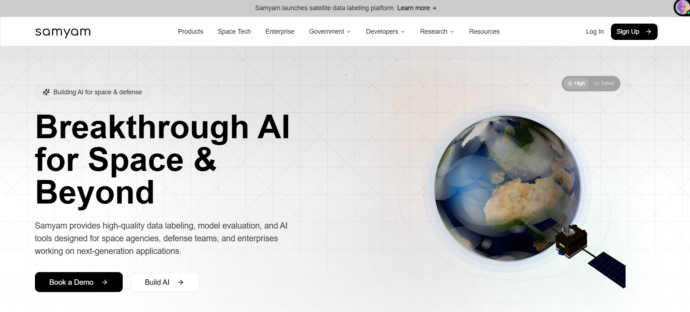
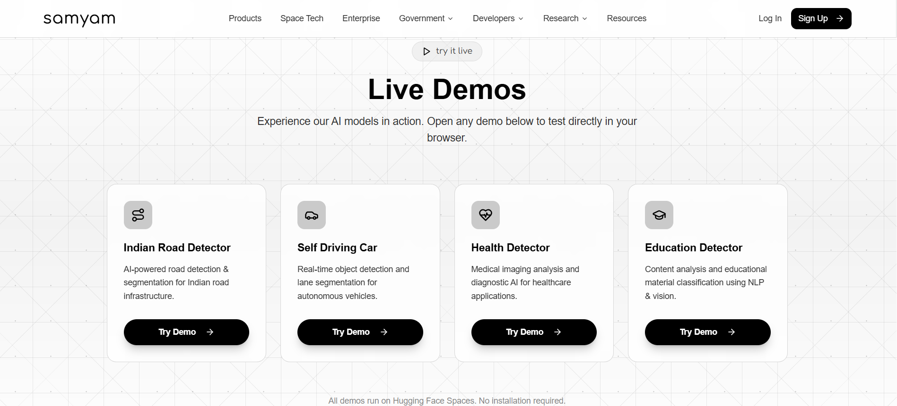
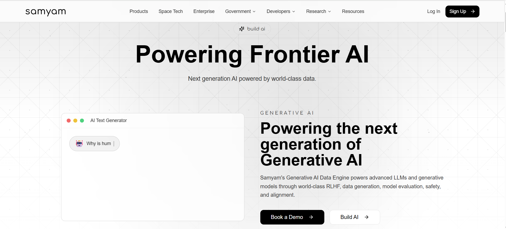
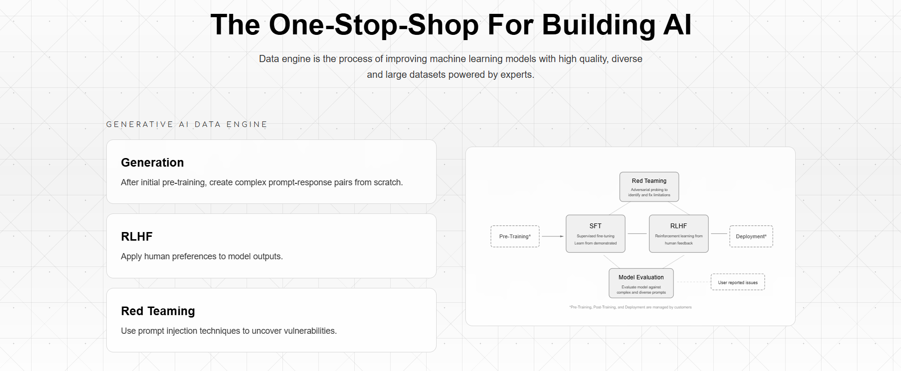
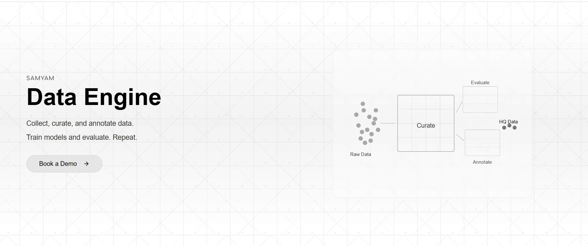
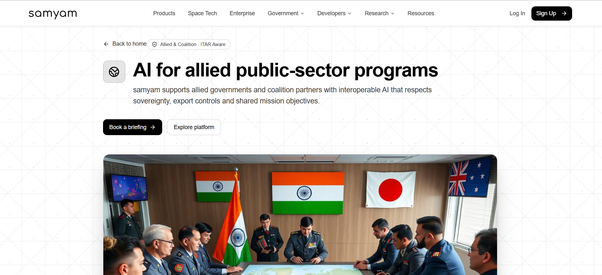
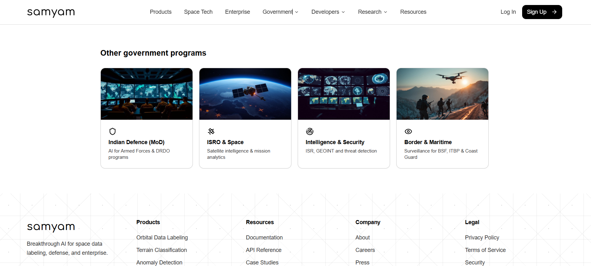
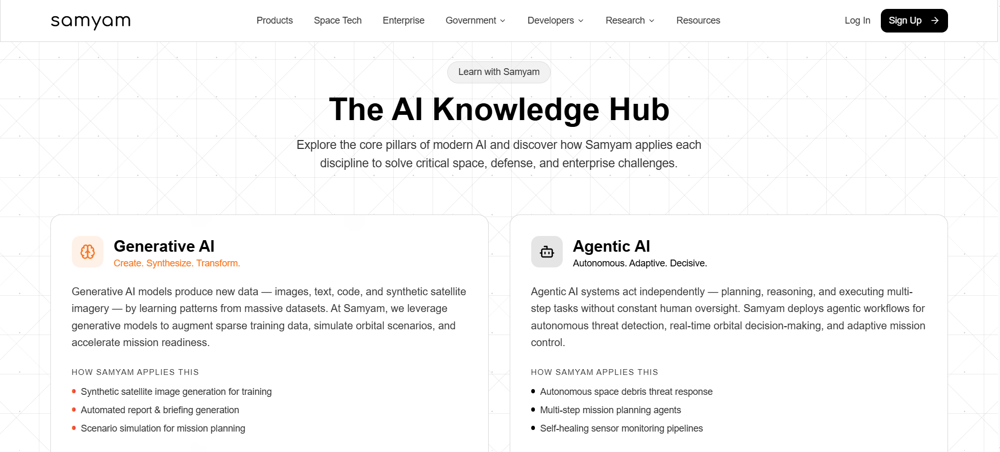
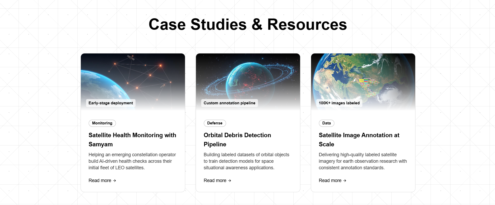
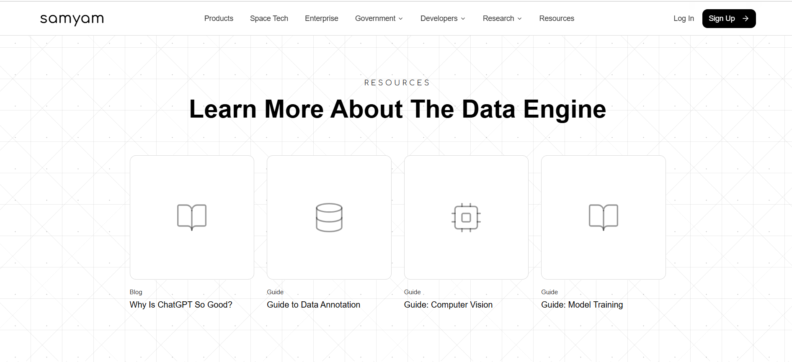

<div align="center">

# 🌍 SamyamLM

## Satellite-Based Multimodal Data Labeling for Indian Language AI

**Scale AI for India — 59% faster, 100% native Hindi support**

[](LICENSE)
[](https://www.makeinindia.com)
[](https://www.python.org)
[](https://pytorch.org)
[](https://huggingface.co/spaces/techindro/SamyamLm-Demo)
[](https://huggingface.co/techindro)
[](https://samyam-space-labels.vercel.app)

</div>

---

## 🌐 Platform Overview



> *"Building AI for space & defense — Breakthrough AI for Space & Beyond"*

Samyam provides high-quality data labeling, model evaluation, and AI tools designed for space agencies, defense teams, and enterprises working on next-generation applications.

---

## 🚀 Live Demos

Experience our AI models in action. All demos run on Hugging Face Spaces — no installation required.



| Demo | Description | Link |
|------|-------------|------|
| 🛣️ Indian Road Detector | AI-powered road detection & segmentation for Indian road infrastructure | [Try Now](https://huggingface.co/spaces/techindro/SamyamLm-Demo) |
| 🚗 Self Driving Car | Real-time object detection and lane segmentation for autonomous vehicles | [Try Now](https://huggingface.co/spaces/techindro/SamyamLm-SelfDriving) |
| 🏥 Health Detector | Medical imaging analysis and diagnostic AI for healthcare applications | [Try Now](https://huggingface.co/spaces/techindro/SamyamLm-Health) |
| 📚 Education Detector | Content analysis and educational material classification using NLP & vision | [Try Now](https://huggingface.co/spaces/techindro/SamyamLm-Education) |

🌐 Website: [samyam-space-labels.vercel.app](https://samyam-space-labels.vercel.app)

---

## 📖 What is SamyamLM?

SamyamLM is a **breakthrough AI platform for space, defense, and enterprise** — purpose-built for Indian languages and Indian geography. It helps create training data for AI models using satellite images, road cameras, and Hindi text.

### The Name

- **Samyam** (संयम) = Discipline and control in Sanskrit
- **LM** = Language Model

So SamyamLM means disciplined, high-quality data labeling for AI systems in India.

### What Problem Does It Solve?

Most AI labeling companies like Scale AI, Labelbox, and Appen were built for Western countries. They don't work well for India because:

1. They don't support Hindi or other Indian scripts
2. They don't understand Indian road conditions (auto-rickshaws, cattle, potholes)
3. They can't process satellite images of Indian geography
4. They fail in Indian weather (monsoon, dust, night driving)

**The result:** AI models that work perfectly in San Francisco but fail in Mumbai, Delhi, and Chennai.

### How Does SamyamLM Work?

The platform has six parts that work together:

| Part | What It Does |
|------|---------------|
| 🛰️ Satellite Imagery | Takes pictures from ISRO satellites (5m to 30m resolution) |
| 📷 Ground Cameras | Records video from cameras on Indian roads |
| 📝 Hindi Text | Reads and understands Hindi language inputs |
| 🤖 AI Pre-labeling | Does 58% of the work automatically using AI models |
| 👨‍💻 Human Review | Lets people check and fix labels using Hindi keyboard |
| ✅ Quality Check | Runs 3 tests to ensure labels are correct |

---

## 📊 Key Results at a Glance

| Metric | SamyamLM | Industry Average | Improvement |
|--------|----------|------------------|-------------|
| Annotation Throughput | 510 labels/hour | 320 labels/hour | **+59%** |
| Hindi VQA Accuracy | 67.4% | 51.8% | **+15.6%** |
| India-Specific Object Detection | 58.3% mAP | 38.6% mAP | **+19.7%** |
| Cost per Label | $0.12 | $0.29 | **-58%** |

---

## 🎯 The Problem

**Global AI training data ignores 1.4 billion Indian voices.**

Existing platforms like Scale AI, Labelbox, and Appen were built for Western markets:

| Limitation | Consequence |
|------------|-------------|
| No Indic script support | Cannot annotate in Hindi, Tamil, Telugu, Bengali |
| No Indian semantic understanding | Models fail on cultural context |
| No satellite geospatial integration | Disaster response AI is blind |
| No Indian road objects | Self-driving cars miss auto-rickshaws and cattle |

---

## 🚀 The Solution

SamyamLM is the first data labeling platform purpose-built for India's linguistic and geographic diversity.

### Comparison with Existing Platforms

| Feature | Scale AI | Labelbox | Appen | SamyamLM |
|---------|----------|----------|-------|----------|
| Hindi Language Support | ❌ | ❌ | Partial | ✅ Native |
| Devanagari Script UI | ❌ | ❌ | ❌ | ✅ Yes |
| Satellite Imagery Input | ❌ | ❌ | ❌ | ✅ Yes |
| India-Specific Objects | ❌ | ❌ | ❌ | ✅ 47 classes |
| Indian Road Conditions | ❌ | ❌ | ❌ | ✅ Yes |
| Adverse Weather (Monsoon) | ❌ | ❌ | ❌ | ✅ Yes |
| Cost per Label | $0.29 | $0.27 | $0.25 | $0.12 |

---

## 🛰️ Space Tech & Defense



SamyamLM extends beyond roads and language — it is built to power **next-generation space and defense AI**.

### Breakthrough AI for Space & Beyond

Samyam provides high-quality data labeling, model evaluation, and AI tools designed for:
- Space agencies (ISRO and allied partners)
- Defense teams and armed forces
- Enterprises working on next-generation applications

### Generative AI Data Engine



Samyam's Generative AI Data Engine powers advanced LLMs and generative models through world-class:

| Capability | Description |
|------------|-------------|
| **Generation** | After initial pre-training, create complex prompt-response pairs from scratch |
| **RLHF** | Apply human preferences to model outputs for alignment |
| **Red Teaming** | Use prompt injection techniques to uncover model vulnerabilities |
| **Model Evaluation** | Evaluate model against complex and diverse prompts |
| **SFT** | Supervised fine-tuning — learn from demonstrated behavior |

The full pipeline: `Pre-Training → SFT → RLHF → Deployment`, with Red Teaming and Model Evaluation running in parallel.

### Samyam Data Engine



> *Collect, curate, and annotate data. Train models and evaluate. Repeat.*

The Data Engine follows a continuous loop:

```
Raw Data → Curate → Evaluate / Annotate → HQ Data
```

This loop ensures consistently high-quality labeled data for every training cycle.

---

## 🏛️ Government & Defense Programs



SamyamLM supports government agencies and defense organizations across India and allied nations.

### AI for Allied Public-Sector Programs

Samyam supports allied governments and coalition partners with **interoperable AI** that respects:
- Sovereignty and data security
- Export controls (ITAR Aware)
- Shared mission objectives

### Indian Government Programs



| Program | Focus |
|---------|-------|
| 🛡️ **Indian Defence (MoD)** | AI for Armed Forces & DRDO programs |
| 🛰️ **ISRO & Space** | Satellite intelligence & mission analytics |
| 🔍 **Intelligence & Security** | ISR, GEOINT and threat detection |
| 🌊 **Border & Maritime** | Surveillance for BSF, ITBP & Coast Guard |

---

## 🧠 AI Knowledge Hub



Samyam is building **"The AI Knowledge Hub"** — exploring core pillars of modern AI and how Samyam applies each discipline to solve critical space, defense, and enterprise challenges.

### Core AI Disciplines

**Generative AI** — *Create. Synthesize. Transform.*
> Generative AI models produce new data — images, text, code, and synthetic satellite imagery — by learning patterns from massive datasets. Samyam leverages generative models to augment sparse training data, simulate orbital scenarios, and accelerate mission readiness.
- Synthetic satellite image generation for training
- Automated report & briefing generation
- Scenario simulation for mission planning

**Agentic AI** — *Autonomous. Adaptive. Decisive.*
> Agentic AI systems act independently — planning, reasoning, and executing multi-step tasks without constant human oversight. Samyam deploys agentic workflows for autonomous threat detection, real-time orbital decision-making, and adaptive mission control.
- Autonomous space debris threat response
- Multi-step mission planning agents
- Self-healing sensor monitoring pipelines

---

## 📂 Case Studies & Resources



### Highlighted Case Studies

| Case Study | Category | Description |
|------------|----------|-------------|
| **Satellite Health Monitoring with Samyam** | Monitoring | Helping an emerging constellation operator build AI-driven health checks across their initial fleet of LEO satellites |
| **Orbital Debris Detection Pipeline** | Defense | Building labeled datasets of orbital objects to train detection models for space situational awareness applications |
| **Satellite Image Annotation at Scale** | Data | Delivering high-quality labeled satellite imagery for earth observation research with consistent annotation standards (100K+ images labeled) |

### Learning Resources



| Type | Title |
|------|-------|
| Blog | Why Is ChatGPT So Good? |
| Guide | Guide to Data Annotation |
| Guide | Guide: Computer Vision |
| Guide | Guide: Model Training |

---

## 📊 Benchmark Results

### Hindi Visual Question Answering (IndicVQA Benchmark)

| Model | Accuracy |
|-------|----------|
| SamyamLM-VL (ours) | **67.4%** |
| MuRIL-VL | 51.8% |
| Flamingo-9B | 34.1% |
| CLIP (zero-shot) | 28.7% |

**SamyamLM improvement: +15.6% over best baseline**

### Indian Road Object Detection (mAP@0.5)

| Model | mAP |
|-------|-----|
| SamyamLM fine-tuned (ours) | **58.3%** |
| Scale AI fine-tuned | 38.6% |
| YOLOv8 (COCO) | 31.2% |

**SamyamLM improvement: +19.7% over Scale AI on India-specific classes**

### Annotation Throughput (labels per hour)

| Platform | Labels/Hour |
|----------|-------------|
| SamyamLM (ours) | **510** |
| Scale AI | 320 |
| Labelbox | 280 |
| Appen | 260 |

**SamyamLM advantage: 59% faster than Scale AI**

---

## 🛰️ India-Specific Object Classes (47)

SamyamLM detects objects that other platforms completely miss:

| Category | Examples |
|----------|----------|
| **Vehicles** | Auto-rickshaw (ऑटो-रिक्शा), Cycle-rickshaw (साइकिल-रिक्शा), Tractor (ट्रैक्टर), Tempo (टेंपो), Bullock cart (बैलगाड़ी) |
| **Animals** | Cattle (मवेशी), Stray dog (आवारा कुत्ता), Buffalo (भैंस), Camel (ऊंट), Elephant (हाथी) |
| **Road Conditions** | Kutcha road (कच्ची सड़क), Pothole (गड्ढा), Speed breaker (स्पीड ब्रेकर), Missing signage (गायब साइनेज) |
| **Adverse Weather** | Monsoon rain (मानसून बारिश), Dust haze (धूल भरी आंधी), Night driving (रात में ड्राइविंग), Dense fog (घना कोहरा) |

---

## 📁 Dataset v1.0 Statistics

| Split | Modality | Samples | Annotated Labels |
|-------|----------|---------|------------------|
| Train | Satellite | 120,000 | 1,840,000 |
| Val | Satellite | 15,000 | 230,000 |
| Train | Ground Driving | 80,000 | 2,100,000 |
| Val | Ground Driving | 10,000 | 260,000 |
| Train | Hindi VQA | 45,000 | 90,000 |
| Val | Hindi VQA | 5,000 | 10,000 |
| **Total** | **All** | **275,000** | **4,530,000** |

---

## 🏗️ Technology Stack

| Layer | Technologies |
|-------|--------------|
| Vision-Language Model | CLIP (ViT-B/32), Fine-tuned checkpoint |
| Deep Learning | PyTorch 2.0+, HuggingFace Transformers |
| Geospatial | GDAL, Rasterio, ISRO Resourcesat-2A API |
| Backend | FastAPI, PostgreSQL, Redis |
| Frontend | React, Devanagari keyboard integration |
| Infrastructure | AWS S3, EC2, CloudFront |

---

## 🔮 What's Next?

- Support for all 22 Indian languages
- Real-time satellite data processing
- API for companies to use
- Expansion to other countries like Indonesia and Nigeria
- Deeper integration with ISRO mission analytics
- Expansion of Agentic AI workflows for defense applications

---

## 📜 License

MIT — Free to use, modify, and distribute.

---

## 🤝 Contributing

PRs welcome! Let's Build the future of Bharat 🇮🇳
